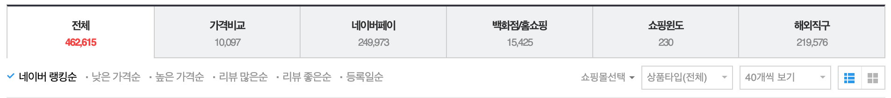
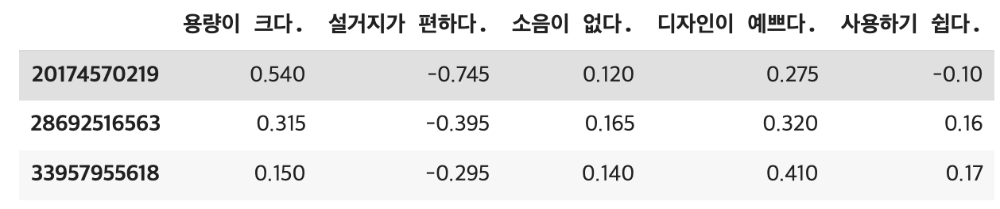

# AI로 쇼핑 쉽게하기
작성자: 윤용선


## 1. Introduction
쇼핑은 많은 인지적 비용을 초래합니다. 소비자는 합리적인 소비를 위해 제품 정보를 수집하고, 분석하고, 비교합니다. 하지만 수많은 상품을 모두 비교하여 최적의 선택을 내리는 일은 정말 어렵습니다. 결국 소비자들은 선택의 폭이 넓을 때 오히려 불만족을 느끼는 선택의 역설Paradox of choice을 마주하게 됩니다.



네이버 쇼핑에서 에어프라이어를 검색한 결과. 40만 개 이상의 상품이 검색된다.

이 프로젝트는 쇼핑에 필요한 인지 과정을 대신할 수 있는 AI를 만들기 위해 시작되었습니다. 단순히 기업이 내가 원하는 상품을 추천해줄 것이라고 기대하는 것이 아니라, 나의 기준을 토대로 상품을 평가하고 비교할 수 있는 AI를 만드는 것이 목적입니다.

하지만 데이터 없이 추천 모델을 학습하는 것은 어렵습니다. 그렇다고 많은 시간을 들여 학습 데이터를 만드는 것도 부담입니다. 따라서 이 프로젝트에서는 다양한 Zero-shot NLP 문제에 활용되는 Natural Language Inference를 사용합니다. NLI 모델로 리뷰를 분석함으로써 내가 가장 원하는 상품을 선택할 수 있습니다.

## 2. Related works
### 2.1. Natural Language Inference

NLI는 두 문장(premise와 hypothesis)의 관계를 분류하는 문제입니다. 기준이 되는 문장(premise)이 있을 때, 다른 문장(hypothesis)의 의미가 논리적으로 합당한지(entailment), 모순되는지(contradiction) 분류합니다. 주로 알 수 없음(neutral)까지 더해 3개의 클래스로 구성됩니다.

예시 (from KLUE)

- premise: 101빌딩 근처에 나름 즐길거리가 많습니다.
- hypothesis1: 101빌딩 부근에서는 여러가지를 즐길수 있습니다. → entailment
- hypothesis2: 101빌딩 주변에 젊은이들이 즐길거리가 많습니다. → neutral
- hypothesis3: 101빌딩 근처에서 즐길거리 찾기는 어렵습니다. → contradiction

### 2.2. NLI for zero-shot

NLI는 문장간의 논리 관계를 학습하기 때문에 다른 자연어 처리 문제에 적용할 수 있습니다. 가장 대표적인 문제는 문장 분류 입니다 [1]. 분류할 문장을 premise로, 문장에 대한 예측 문장을 hypothesis로 설정합니다.

예)

- premise: 어빙 NBA 통산 1만 점…보스턴 동부 1위 토론토 제압…
- hypothesis1: 이 문장은 정치에 관한 문장이다.
- hypothesis2: 이 문장은 스포츠에 관한 문장이다.

위와 같이 예측할 클래스로 hypothesis를 구성해 NLI 모델에 입력 후 가장 entailment 확률이 높은 문장의 클래스로 문장을 분류하는 방법입니다.

NLI 모델은 문장 분류 뿐만 Named entity recognition, Relation extraction 등 다양한 자연어처리 문제에 활용될 수 있습니다[2].

## 3. Method
이 프로젝트에서 개발한 방법의 개요는 다음과 같습니다.

1. (사람) 후보 상품 리스트 정의
2. (사람) 판단 기준 정의
3. (AI) 상품 리뷰 크롤링
4. (AI) NLI 모델을 활용한 상품 평가 및 비교

### 3.1. 후보 상품 리스트 정의
먼저 간단한 검색을 통해 비교할 상품 리스트를 작성합니다. 만약 검색된 모든 상품에 대해 분석을 진행하고 싶다면 이 과정을 생략해도 좋습니다. 

상품을 정의하는 방법은 사용하는 쇼핑 플랫폼에 따라 다릅니다. 이 프로젝트는 네이버 쇼핑을 사용했으며, 네이버 쇼핑에서 사용하는 상품 ID로 상품을 정의했습니다.

```python
candidates = ['20174570219', '28692516563', '33957955618']
```

### 3.2. 판단 기준 정의
다음으로 나만의 판단 기준을 정의합니다. 예를 들어 에어프라이어를 구매할 경우, 다음과 같은 기준을 사용할 수 있습니다.

```python
criterions = [
    '용량이 크다.',
    '설거지가 편하다.',
    '소음이 없다.',
    '디자인이 예쁘다.',
    '사용하기 쉽다.'
]
```

### 3.3. 상품 리뷰 크롤링
상품 리뷰를 크롤링합니다. 이 프로젝트는 selenium을 사용해 리뷰를 수집했습니다.

```python
def collect_reviews(product_id, driver):
    page = 1
    product_url = f'https://search.shopping.naver.com/catalog/{product_id}'
    driver.get(product_url)

    reviews = []
    for page in range(1, 11):
        page_btn = driver.find_element(By.XPATH, f"//a[@data-nclick='N=a:rev.page,r:{page}']")
        page_btn.click() 
        time.sleep(1)

        html = driver.page_source
        soup = BeautifulSoup(html, 'html.parser')
        _reviews = soup.select('p[class^="reviewItems_text"]')
        _reviews = [r.text for r in _reviews]
        reviews += _reviews
    
    return reviews

product_id = candidates[0]
driver = webdriver.Chrome('chromedriver')
reviews = collect_reviews(product_id, driver)
```

### 3.4. NLI 모델을 활용한 상품 평가 및 비교
마지막으로 수집한 리뷰에 NLI 모델을 적용합니다. 리뷰 문장을 premise로, 나의 기준 문장을 hypothesis로 정의 후 NLI 모델에 입력합니다. NLI 모델이 두 문장의 관계를 entailment로 예측하면 상품 점수에 1을 더하고, contradiction으로 예측하면 1을 빼줍니다. 리뷰 수에 따른 영향을 없애기 위해 점수를 리뷰 수로 나눴습니다. 

NLI 모델 학습을 위해, TUNiB에서 공개한 [tunib/electra-ko-base](https://huggingface.co/tunib/electra-ko-base) 을 [KLUE NLI](https://huggingface.co/datasets/klue) 데이터와 Kakao에서 공개한 [KorNLU](https://github.com/kakaobrain/kor-nlu-datasets) 데이터로 fine-tuning 했습니다.

```python
def split_reviews(reviews):
    sentence_reviews = []
    for review in reviews:
        sentence_reviews += [s.text for s in kiwi.split_into_sents(review)]
    return sentence_reviews

def evaluate_reviews(model, tokenizer, reviews, criterions, batch_size=16):
    device = next(model.parameters()).device
    num_reviews = len(reviews)
    reviews = split_reviews(reviews)

    points = []
    for criterion in criterions:
        hypothesis = f'이 제품은 {criterion}'
        point = 0

        for i in range(0, len(reviews), batch_size):
            batch_reviews = reviews[i:i+batch_size]
            batch_criterion = [criterion] * len(batch_reviews)
            inputs = tokenizer(batch_reviews, batch_criterion, padding=True, truncation='only_first', max_length=128, return_tensors='pt')
            inputs = inputs.to(device)
            outputs = model(**inputs)

            preds = outputs.logits.argmax(dim=-1)
            point += len(torch.where(preds == 0)[0])
            point -= len(torch.where(preds == 2)[0])

        point /= num_reviews
        points.append(point)
    
    return points

device = 'cuda:0'
model_name = 'yongsun-yoon/electra-ko-base-nli'
tokenizer = AutoTokenizer.from_pretrained(model_name)
model = AutoModelForSequenceClassification.from_pretrained(model_name)
_ = model.eval().requires_grad_(False).to(device)

points = evaluate_reviews(model, tokenizer, reviews, criterions)
```

### 3.5. 결과
상품 별로 이 과정을 반복하면 다음과 같은 결과를 얻을 수 있습니다. 결과를 통해 상품별 장단점을 쉽게 파악하고 비교할 수 있습니다. 기준 별로 가중치를 더해 결과를 가중합하면 상품별로 하나의 점수를 매길 수 있으며 따라서 더욱 쉽게 선택할 수 있습니다.



## 4. Conclusion
이 프로젝트에서는 나만의 기준으로 상품을 평가하고 비교하는 시스템을 개발하였습니다. NLI 모델을 활용함으로써 리뷰 평가 문제를 쉽게 해결할 수 있었습니다. 

후속 진행 방향은 다음과 같습니다.

1. NLI 데이터 확장을 통한 NLI 모델 성능 개선: 영어 데이터를 활용하거나 LLM으로 도메인 특화 NLI 데이터를 생성하여 NLI 모델 성능을 향상시킵니다.
2. 평가 알고리즘 실험: entailment, neutral, contradiction logits으로부터 점수를 계산하는 다양한 방법을 실험하여 성능을 개선합니다. 

## Reference
[1] Yin, W., Hay, J., & Roth, D. (2019). Benchmarking zero-shot text classification: Datasets, evaluation and entailment approach. *arXiv preprint arXiv:1909.00161*.

[2] Sainz, O., Qiu, H., de Lacalle, O. L., Agirre, E., & Min, B. (2022). ZS4IE: A toolkit for zero-shot information extraction with simple verbalizations. *arXiv preprint arXiv:2203.13602*.
