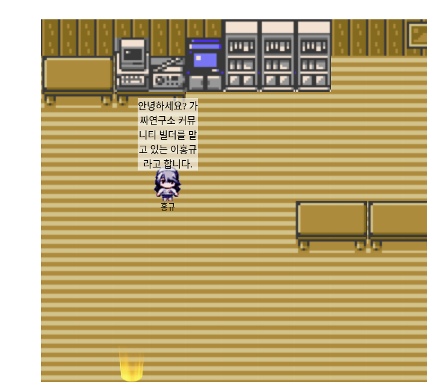

# 지금까지의 메타버스는 잊어라

## 1. **프로젝트를 소개**

1. 스테이블 디퓨전을 파인튜닝해서 나만의 캐릭터를 만들 수 있는 모델을 만듭니다.
2. 모델과 프롬프트를 넣음으로써 나만의 캐릭터를 만들고, 공간에서 함께 소통합니다.

## 2. 프로젝트 계획

1. 한결님께서 발표해주신 **소프트웨어 개발 “메타”**의 변화에 많은 영향을 받았습니다.
2. 이미 완성된 모델(e.g. [**runwayml/stable-diffusion-v1-5**](https://huggingface.co/runwayml/stable-diffusion-v1-5))을 통해 가능성을 시험해보고, 가능하겠다 싶으면 그 때부터 본격적으로 리소스를 투입하는 형태로 진행했습니다.
3. Dreambooth나 Textual Inversion처럼 적은 수의 데이터셋을 통한 파인튜닝이 가능한지를 먼저 시험해보고 된다면 일단은 해당 알고리즘을 바탕으로 프로젝트를 진행하려고 했습니다.

## 3. **Dreambooth**

### 3.1. 기술 소개

- Dreambooth는 위 예시처럼 어떠한 토큰(e.g.`[V]`)에 의미를 주입하는 테크닉입니다.
- **Prior Perservation Loss**를 통해 기존 토큰들의 의미를 최대한 보존하면서, `[V]`에 대한 새로운 의미를 학습하는 것이 주된 목표입니다.

### 3.2. 사용 후기

- 비교대상인 Textual Inversion에 비해 더 좋은 결과물이 나오는 느낌이었습니다.
- 아무래도 (Textual Inversion과 달리) 모델 전체를 학습하기 때문으로 추정합니다.
- 다만 프롬프트를 semantic하게 받아드린다는 느낌은 약했습니다.
- 또한 결국 기본적으로 모델 전체가 아닌 특정 토큰에 국한되어 태스크가 전달되기 때문이 아닐까 싶습니다.
- 프롬프트가 길어질 경우, 태스크 토큰 `[V]`의 의미가 희미해져 캐릭터 스프라이트가 아닌 엉뚱한 것이 생성되는 문제도 있었습니다.

## 4. **Textual Inversion**

- Textual Inversion에서는 기존 모델의 **모든 파라미터를 freeze합니다.**
- 그 다음 새로운 토큰(위 예시에서는 $S_*$)을 추가하고, 해당 토큰만을 학습대상으로 합니다.
- 모델의 모든 레이어와 임베딩은 그대로 유지됩니다.
- 단, 새로 추가한 $S_*$토큰에만 우리가 주입하고자하는 어떠한 "콘셉트"가 주입되는 방식입니다.`
- 아무래도 임베딩만 새로 학습하는 방식이다 보니 원하는 결과물을 얻는 것에는 실패했습니다.

## 5. **AI 이외의 기술들**

1. WebRTC ——- Video chat을 구현하과 WebRTC를 사용했습니다. peerjs라는 라이브러리를 사용했는데, 다음에는 from-scratch로 구현하는 게 더 나을 거 같다는 생각을 했습니다.
2. WebSocket — 기본적인 캐릭터와 서버간의 상호작용은 Web Socket에 기반합니다.
3. Goroutine —— Go만의 Identity라고 할 수 있는 개념입니다. 멀티스레딩이라는 것 정도만 알고 있습니다.
4. Svelte ———— 프론트엔드는 svelte로 만들었습니다. react가 더 좋은 것 같습니다 :)

## **프로젝트 예시**

---